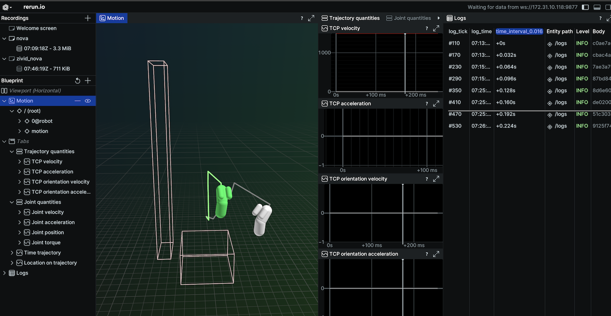

# nova rerun bridge

Showcases [rerun.io](https://rerun.io) integration into nova.

It visualizes:

- robot
- trajectory
- dh parameters of robot
- collision model of robot
- safety zones of the robot controller
- collision objects defined in the collision store

Install the app with the nova cli tool by running:

```bash
nova catalog install rerun
```

to use it on your nova instance.



## Run locally with the rerun desktop app

- adjust the `WANDELAPI_BASE_URL` and `NOVA_ACCESS_TOKEN` in the `.env` file to your instance URL (e.g. `https://unzhoume.instance.wandelbots.io`)
- run `poetry install` to install the dependencies
- run `python scripts/populate.py` to start a service which periodically polls the nova instance for new planned trajectories
- run `python scripts/stream_motion_groups.py` to start a service which streams the state of the active motion groups

## Development

### Deploy on local instance

- use the kubeconfig from your nova instance and run `export KUBECONFIG=kubeconfig`

- you can use [skaffold](https://skaffold.dev/) to build the image and change the deployment

```bash
skaffold dev --cleanup=false --status-check=false
```

### Tools

- code formatting and linting is done with [ruff]

```bash
poetry run ruff check scripts/. --fix
poetry run ruff format
```

## Issues

- rerun is able to run behind reverse proxy and the viewer can connect via web
- rerun sdk is _not_ able to connect to rerun which is hosted behind reverse proxy
  - [client](https://github.com/rerun-io/rerun/blob/cf9299d9205134713687e54fdf13551ed1f44bce/crates/store/re_sdk_comms/src/buffered_client.rs#L2) communicates just via sockets
  - intermediate solution is [socat](https://linux.die.net/man/1/socat)

```bash
brew install socat
socat TCP4-LISTEN:6666,fork SYSTEM:"curl -X POST -d @- http://172.30.2.224/some/rerun/sdk/"

{ echo "load_module /usr/lib/nginx/modules/ngx_stream_module.so;"; cat /etc/nginx/nginx.conf; } > temp_file && mv temp_file /etc/nginx/nginx.conf
```
